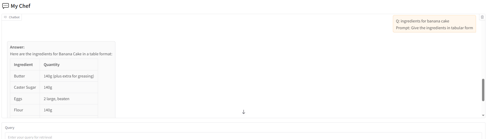

# Capstone Project: RAG Chatbot with Gradio

This capstone project brings together all the concepts covered so far to build a **simple Retrieval-Augmented Generation (RAG) chatbot** using Gradio. The chatbot answers user questions based on retrieved documents but does **not remember past conversations** — each query is handled independently.

## Features

- **Query**: Enter a question through a text box.
- **Prompt**: The prompt to instruct the LLM.
- **Top-k Control**: Users can set how many results (`k`) to retrieve from the vector store.
- **View Retrieved Results**: The top-k chunks are displayed on screen before generating the answer.
- **Stateless Design**: No conversation history is stored; each question is processed separately.

## Learning Objectives

- Implement retrieval using embeddings (dense).
- Apply prompt engineering to ground model responses in retrieved context.
- Experiment with different values of *k* to see their impact on answer quality.
- Integrate a RAG pipeline into a simple, interactive **Gradio UI**.

---

By the end of this project, you’ll have a working chatbot prototype that demonstrates how RAG can power Q&A applications with an easy-to-use web interface.
